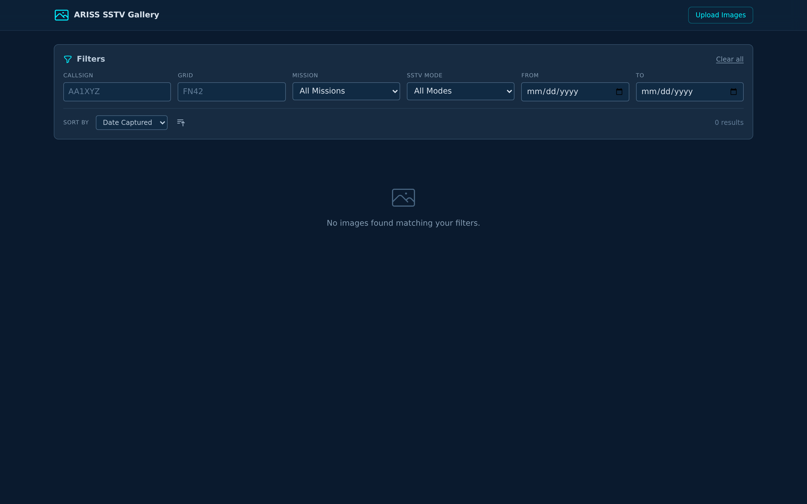
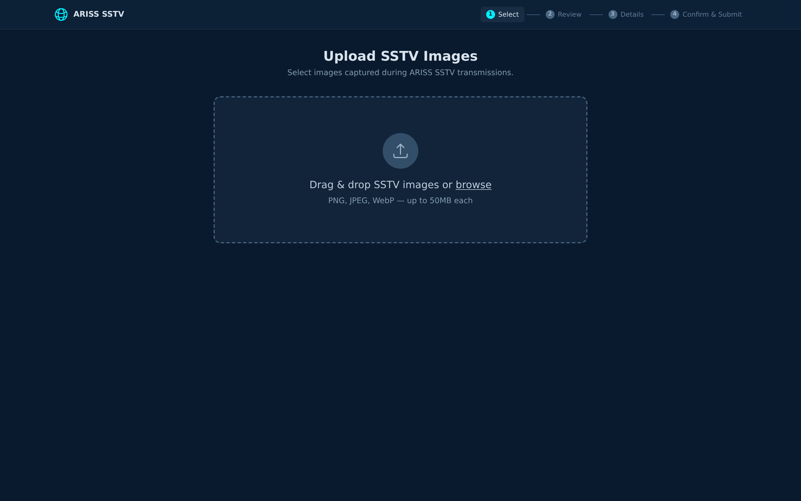
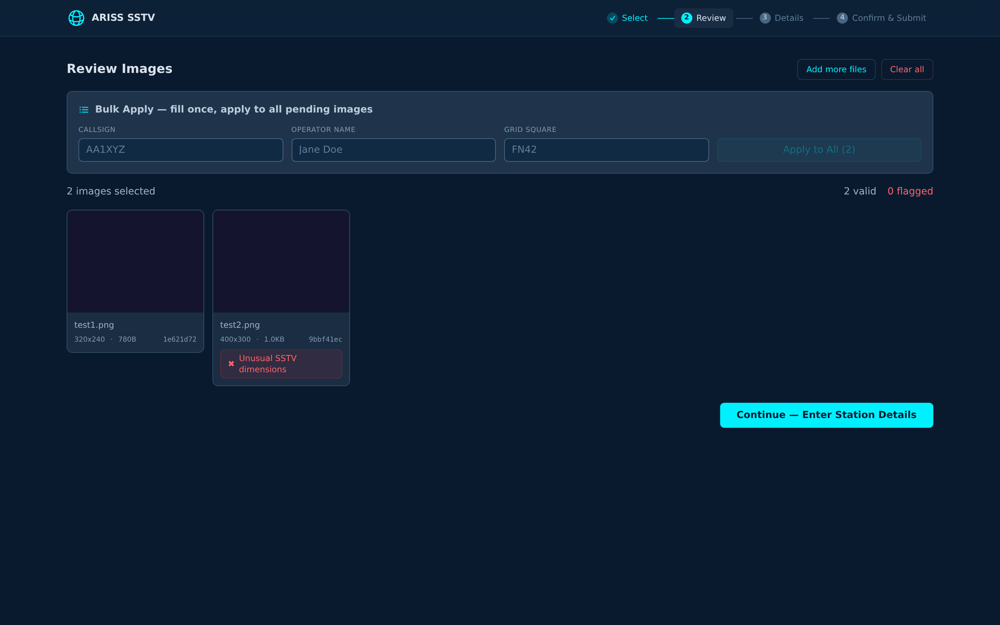
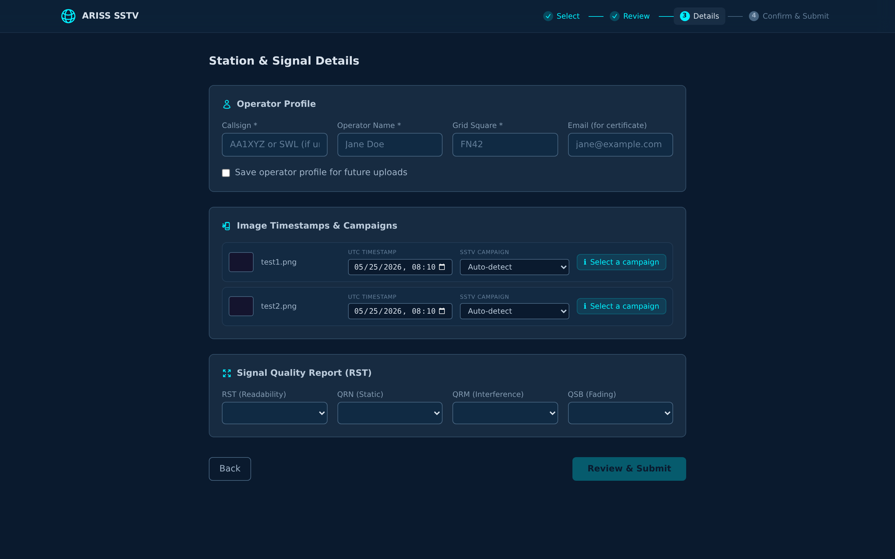
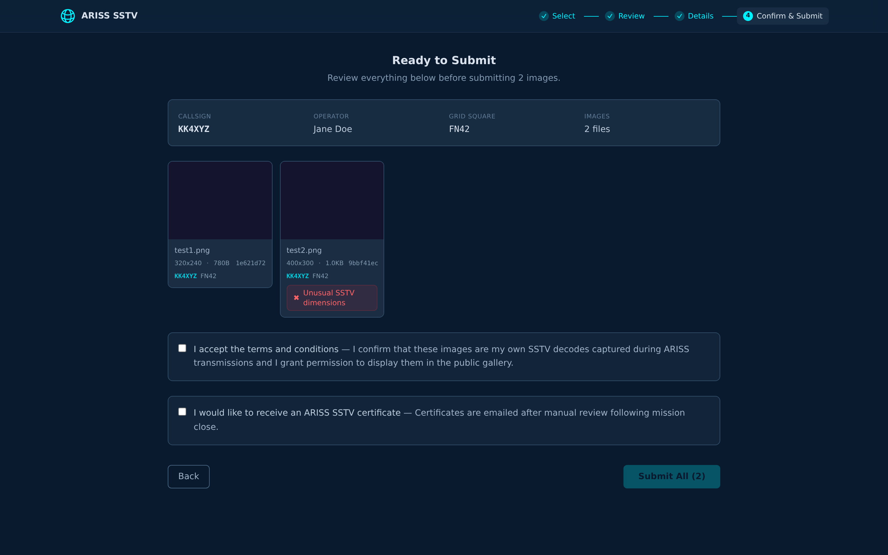

# ARISS SSTV Gallery

An Angular 21 + Tailwind application for submitting SSTV (Slow Scan Television) images decoded from ARISS (Amateur Radio on the International Space Station) transmissions.

Built with a dark space/aerospace theme, the app provides a batch upload wizard, per-image metadata editing, campaign validation against ARISS mission windows, and a public gallery with infinite scroll.

⚠️ **Note:** This is an unofficial, community-driven passion project built for experimentation and fun.

## Features

- **Batch Upload Wizard** — 4-step flow: select, review, station details, confirm & submit
- **Drag & Drop** — multi-file upload with visual state feedback
- **Per-Image Metadata** — UTC timestamps, mission/campaign selection, signal quality reports
- **Bulk Operations** — apply callsign/name/grid-square to all images at once
- **Campaign Validation** — auto-detect ARISS mission from timestamp; validate against campaign windows
- **Signal Quality Report** — RST readability, QRN (static), QRM (interference), QSB (fading)
- **Gallery** — CSS columns masonry layout with IntersectionObserver infinite scroll
- **Image Lightbox** — full-resolution preview
- **Certificate Opt-In** — request personalized ARISS award certificate via email
- **Operator Profile** — localStorage-persisted profile with one-click save
- **Duplicate Detection** — SHA-256 image hashing
- **Space/Aerospace Theme** — dark mode native, neon-cyan accents, WCAG 2.1 AA contrast

## Screenshots

| Step | Preview |
|------|---------|
| **Gallery Home** |  |
| **Upload — Dropzone** |  |
| **Review Grid** |  |
| **Station Details** |  |
| **Confirm & Submit** |  |

## Tech Stack

| Layer | Technology |
|-------|-----------|
| Framework | Angular 21 (standalone components, Signals) |
| Styling | Tailwind v4 with custom `@theme` palette |
| Typing | TypeScript strict mode |
| Forms | Template-driven with `[ngModel]` + `(ngModelChange)` backed by `WritableSignal` |
| Build | `@angular/build:application` (Vite/esbuild) |
| Hashing | SHA-256 via `crypto.subtle.digest` |
| Persistence | `localStorage` for operator profile |

## Models

- **`OperatorProfile`** — callsign, name, grid-square, email and signal report
- **`UploadFileEntry`** — per-file state: file reference, preview URL, status/progress, timestamps, mission, signal report, image hash, dimensions
- **`SstvSubmission`** — gallery-displayed submission with image URLs, metadata, vote count
- **`ArissMission`** — campaign definition with start/end date, SSTV mode, frequency
- **`GalleryFilterCriteria`** — search, callsign, mission, date range, sort options

## Mission Data

Four hardcoded ARISS missions are defined in `MissionService`:

| Mission | Dates | Status |
|---------|-------|--------|
| ARISS SSTV 2025-1 | Feb 1–7, 2025 | Inactive |
| ARISS SSTV 2025-2 | Apr 15–21, 2025 | Inactive |
| ARISS SSTV 2026-1 | Jan 28–Feb 3, 2026 | **Active** |
| ARISS SSTV 2026-2 | Apr 14–20, 2026 | Inactive |

## Project Structure

```
src/
├── app/
│   ├── components/
│   │   ├── batch-upload/
│   │   │   ├── batch-upload.component.ts       # Wizard orchestrator
│   │   │   ├── dropzone/                       # Drag-and-drop file upload
│   │   │   ├── review-grid/                    # Image review with duplicates
│   │   │   ├── bulk-operations-bar/            # Apply-to-all callsign/name/grid
│   │   │   ├── image-preview-card/             # Per-file thumbnail + status
│   │   │   ├── station-details/                # Operator profile + per-image metadata
│   │   │   └── submit-complete/                # 3-phase submit (confirm/uploading/complete)
│   │   ├── gallery/
│   │   │   ├── gallery.component.ts            # Gallery page
│   │   │   ├── gallery-grid/                   # CSS masonry + infinite scroll
│   │   │   ├── gallery-filter-bar/             # 6-field search/sort
│   │   │   └── lightbox-modal/                 # Full-res image + metadata
│   │   └── shared/
│   │       ├── progress-bar/                   # Upload progress indicator
│   │       └── validation-badge/               # Campaign validation status
│   ├── services/
│   │   ├── upload.service.ts                   # Signal-based file store, chunked upload
│   │   ├── exif-parser.service.ts              # EXIF extraction, SHA-256 hashing
│   │   ├── operator-store.service.ts           # localStorage operator profile
│   │   ├── image-hash.service.ts               # Duplicate detection
│   │   ├── gallery.service.ts                  # Paginated fetch, filters
│   │   └── mission.service.ts                  # ARISS missions, campaign validation
│   ├── models/
│   │   ├── index.ts
│   │   ├── sstv-submission.model.ts
│   │   ├── operator-profile.model.ts
│   │   ├── gallery-filter.model.ts
│   │   └── ariss-mission.model.ts
│   └── styles.css                              # Tailwind v4 theme + custom palette
└── ...
```

## Development

```bash
npm install
ng serve            # http://localhost:4200
npm run build       # Production build → dist/
```

## Tailwind Color Palette

Custom colors defined in `src/styles.css` via `@theme {}`:

- `space-{50..950}` — Cosmic slate grays
- `cosmic-950` — Deepest background
- `neon-cyan` (#00f0ff) — Primary action accent
- `neon-green` (#00ff88) — Success
- `neon-amber` (#ffb224) — Warning
- `neon-magenta` (#ff00aa) — Error/accent

## Contributions
Feedback, UI/UX critiques, and Pull Requests from seasoned frontend developers are highly welcome!